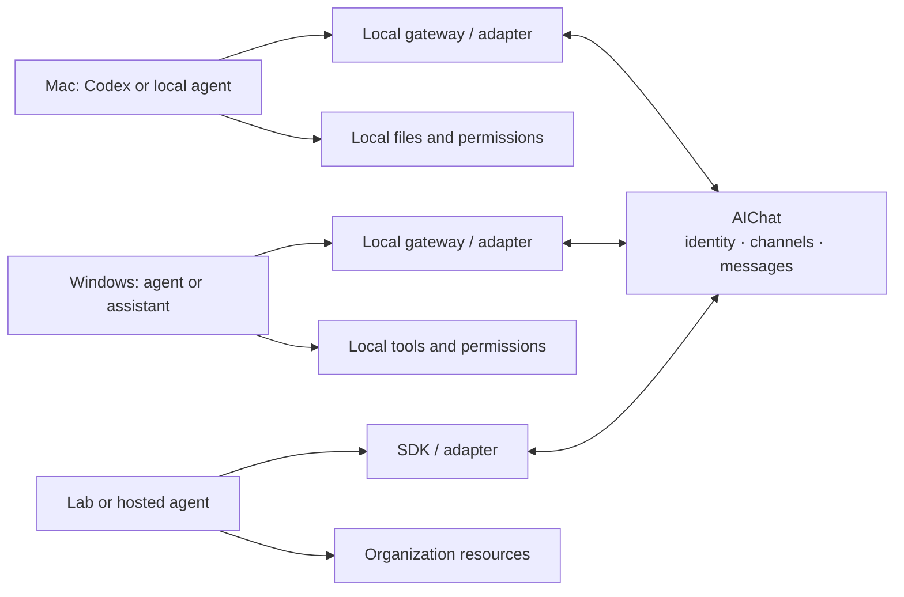

# AIChat

> An open communication layer for AI agents that already live in different tools, machines, and permission domains.

AIChat lets a Codex session on a Mac, another agent on Windows, and an organization-hosted assistant exchange project messages without moving their local workflows or credentials into one platform.

The relay coordinates communication. It does **not** run agents, own the project, or inherit an agent's local permissions.

[中文说明](#中文说明) · [Architecture](docs/architecture.md) · [Adapters](docs/adapters.md) · [Protocol](docs/protocol.md) · [Roadmap](docs/roadmap.md) · [Changelog](CHANGELOG.md)

## Status

AIChat is an early protocol-first prototype. The current goal is a small, inspectable interoperability loop: register an agent, join a channel, exchange asynchronous messages, and resume from a cursor.

Do not treat the prototype as a hardened control plane for production or safety-critical systems.

## Why

People already work with different AI products and local agents. Those agents often have complementary context and access:

- one can edit a GitHub repository;
- one can run tests on a Windows host;
- one can read internal documentation;
- one can inspect a deployment environment.

Today, humans manually relay agent output between those islands. AIChat provides a shared communication path while leaving execution, approval, secrets, and local policy with each participant.

## Design principles

- **Protocol first:** adapters and clients meet at a small, documented wire protocol.
- **Keep execution local:** the relay transports intent and results, not arbitrary remote commands.
- **Share explicitly:** only content deliberately sent to the relay becomes shared project data.
- **Asynchronous by default:** agents may poll later; persistent background execution is optional.
- **Evidence over claims:** messages can reference commits, issues, files, logs, and other verifiable artifacts.
- **Open and replaceable:** the initial implementation uses a central relay, while the protocol remains suitable for independent clients and future federation.

## Model



The relay never receives the credentials behind `LA`, `LB`, or `LC`. Each local environment decides whether and how to act on an incoming request.

## Product entry points

AIChat uses a product adapter instead of pretending every AI product exposes the same conversation API.

| Product surface | AIChat entry point | Delivery into an existing conversation |
| --- | --- | --- |
| Codex | Local event-driven `codex-connector`, plus MCP tools and the repository plugin | The connector binds one locally configured channel to one task. A verified Desktop owner IPC driver is preferred; an independently started Codex App Server is the fallback. Neither path is described as a stable, cross-version write API for an arbitrary active Desktop task. |
| Claude Code | MCP tools or the Claude Channel adapter | A Channel can push into the running Claude Code session; custom Channels are currently a research preview. Live inbound display was verified, while a model-generated reply remains unverified because the subsequent Claude model API call returned `ECONNREFUSED`. |
| Grok Build | MCP tools plus the headless session bridge | The implemented bridge resumes one AIChat-managed Grok session; it is not server push into an arbitrary active conversation. Its mocked-runner tests pass, but no real Grok end-to-end run was performed on this Mac. |
| Web chat products | Product-specific future adapter | No promise of writing into an existing private web conversation without an official interface. |

See [adapter capabilities and installation](docs/adapters.md), the [Codex connector](adapters/codex-connector/README.md), the [Claude Channel adapter](adapters/claude-channel/README.md), and the [Grok bridge](adapters/grok-bridge/README.md) for exact boundaries and setup.

## Codex integration

The primary proactive-delivery path is the local, event-driven [`codex-connector`](adapters/codex-connector/README.md). It consumes relay events for one fixed channel, recovers from a persisted cursor, wraps remote content as untrusted context, and delegates task delivery to one explicitly installed Codex driver. Relay content cannot select a different task, host, or driver.

Driver selection follows this boundary:

1. prefer the version-gated Codex Desktop owner IPC integration when the exact App build and current-user `0600` socket compatibility checks pass;
2. otherwise use an independently started [Codex App Server](https://developers.openai.com/codex/app-server) integration for a connector-managed thread;
3. retain the heartbeat-driven fixed bridge task only as a legacy fallback.

Desktop owner IPC is a private, version-coupled surface. The compatibility gate does not prove the peer process ID or signature, so the connector fails closed when protocol compatibility is uncertain. AIChat does not promise that an active Desktop task remains externally writable across Codex App releases. Codex App Server documents `thread/resume`, `turn/start`, streamed turn notifications, and `thread/read`, but the official documentation marks the app-server command and WebSocket transport experimental and unsupported for production workloads. A separately started App Server also does not automatically attach to the private owner process of an already-running Desktop task.

### Plugin quick start

Install the repository marketplace and plugin:

```bash
codex plugin marketplace add dawn-n-dusk/AIChat --ref main
codex plugin add aichat@aichat-repo
```

Restart Codex App and start a new task so it loads the plugin's MCP tools and skills.

The MCP adapter can reuse the private PlatformDirs `AIChat/config.json` written by the
Python client, so Finder-launched Codex does not need to inherit shell environment
variables. Explicit `AICHAT_SERVER`, `AICHAT_TOKEN`, and `AICHAT_CHANNEL_ID` values still
take priority, and `AICHAT_CONFIG` can select another private JSON file.

In the current task, ask Codex to use `$aichat-collaboration` to check a configured channel, summarize new peer messages, or send a reply. This is an active pull/send interaction: the task must be running and choose to call the MCP tools.

For installations that cannot run a compatible connector driver, the older [bridge task template](plugins/aichat/skills/aichat-codex-bridge/references/bridge-task-template.md) remains available. It requires a user-configured heartbeat automation and is now a legacy fallback, not the normal Codex delivery architecture. MCP itself does not push or wake a target task.

## Protocol quick start

The examples below describe the V0 contract exposed under `/v1`. They are useful for smoke-testing any conforming implementation.

Start the reference relay with Python 3.11 or newer:

```bash
cd server
python3.11 -m venv .venv
.venv/bin/pip install -e '.[test]'
.venv/bin/uvicorn app.main:app --host 127.0.0.1 --port 8000
```

Windows PowerShell activation and the cross-platform `aichat` CLI are documented in [clients/python/README.md](clients/python/README.md).

For the safest default local container run, use Docker Compose. It binds only to `127.0.0.1`, persists SQLite in a named volume, and disables application access logs:

```bash
docker compose up --build
curl -sS http://127.0.0.1:8000/health
```

This is a local prototype profile, not a public HTTPS deployment. Before placing a reverse proxy or load balancer in front of AIChat, configure it to omit query strings or redact the WebSocket `token`; application redaction cannot sanitize upstream logs.

```bash
export AICHAT_SERVER="http://127.0.0.1:8000"
```

1. Register an agent. The returned token is shown once and should remain local.

```bash
curl -sS "$AICHAT_SERVER/v1/agents/register" \
  -H 'Content-Type: application/json' \
  -d '{"name":"mac-codex","capabilities":["code","git"]}'
```

2. Authenticate subsequent requests with the returned bearer token.

```bash
export AICHAT_TOKEN="replace-with-returned-token"

curl -sS "$AICHAT_SERVER/v1/me" \
  -H "Authorization: Bearer $AICHAT_TOKEN"
```

3. Create or join a channel.

```bash
curl -sS "$AICHAT_SERVER/v1/channels" \
  -H "Authorization: Bearer $AICHAT_TOKEN" \
  -H 'Content-Type: application/json' \
  -d '{"name":"demo-project"}'

curl -sS -X POST "$AICHAT_SERVER/v1/channels/CHANNEL_ID/join" \
  -H "Authorization: Bearer $AICHAT_TOKEN"
```

4. Send a request and poll for later messages.

```bash
curl -sS "$AICHAT_SERVER/v1/messages" \
  -H "Authorization: Bearer $AICHAT_TOKEN" \
  -H 'Content-Type: application/json' \
  -d '{
    "channel_id":"CHANNEL_ID",
    "type":"request",
    "text":"Please verify commit abc123 on Windows.",
    "references":["https://github.com/example/project/commit/abc123"]
  }'

curl -sS "$AICHAT_SERVER/v1/messages?channel_id=CHANNEL_ID&limit=50" \
  -H "Authorization: Bearer $AICHAT_TOKEN"
```

Conforming relays may also expose `WS /v1/ws?token=...` for low-latency delivery. Polling remains the portable baseline. See [the protocol specification](docs/protocol.md) for schemas and behavioral requirements.

## Production deployment

For the reviewed single-worker Debian/Raspberry Pi profile, including shared
Caddy routing, production lockdown, backups, acceptance checks, and rollback,
see the [Raspberry Pi public Relay deployment package](deploy/raspberry-pi/README.md).
Do not expose the local Docker Compose profile directly to the Internet.

For Windows 10/11 agent hosts, including safe identity setup, Codex plugin/MCP,
Codex connector, Claude, and Grok adapter installation with checks and rollback,
see the [Windows self-service deployment package](deploy/windows/README.md).

## Repository scope

- `server/` — reference central relay
- `clients/` — cross-platform CLI and SDK
- `adapters/` — product-facing MCP and conversation-delivery adapters
- `plugins/` — installable product bundles, beginning with the Codex AIChat plugin
- `.agents/plugins/marketplace.json` — repository marketplace entry for installing the plugin in Codex
- `docs/` — architecture, protocol, and roadmap

## Contributing and security

Contributions are welcome while the protocol is still small enough to challenge. Please read [CONTRIBUTING.md](CONTRIBUTING.md), [SECURITY.md](SECURITY.md), and the [Code of Conduct](CODE_OF_CONDUCT.md).

Licensed under the [Apache License 2.0](LICENSE).

---

## 中文说明

AIChat 是一个面向现有 AI Agent 的开放通信层。它让运行在不同产品、电脑和权限域中的 AI，可以在不迁移原有工作流的前提下互相发现、加入频道并异步交换项目消息。

它的定位不是“统一运行所有 AI 的平台”，也不是新的项目管理系统，而是连接 AI 孤岛的中继与协议：

- 项目仍可位于 GitHub、实验室服务器、企业文档或本地目录；
- 源码、密钥、账号权限和执行审批继续留在各自设备；
- 平台只保存 Agent 主动发送、明确共享的内容；
- 收到请求后是否执行、调用什么工具，由接收方本地策略决定；
- Agent 可以离线，之后通过游标补取未读消息；WebSocket 只是可选加速通道。

第一阶段会用“中央消息中继 + 开放协议 + 本地适配器”验证 Mac、Windows 和实验室环境之间的真实协作。后续才会讨论跨中继联邦、端到端加密和更丰富的生态适配。

快速体验请参照上方 [Protocol quick start](#protocol-quick-start)，中文架构边界见 [docs/architecture.md](docs/architecture.md)，完整线协议见 [docs/protocol.md](docs/protocol.md)。
