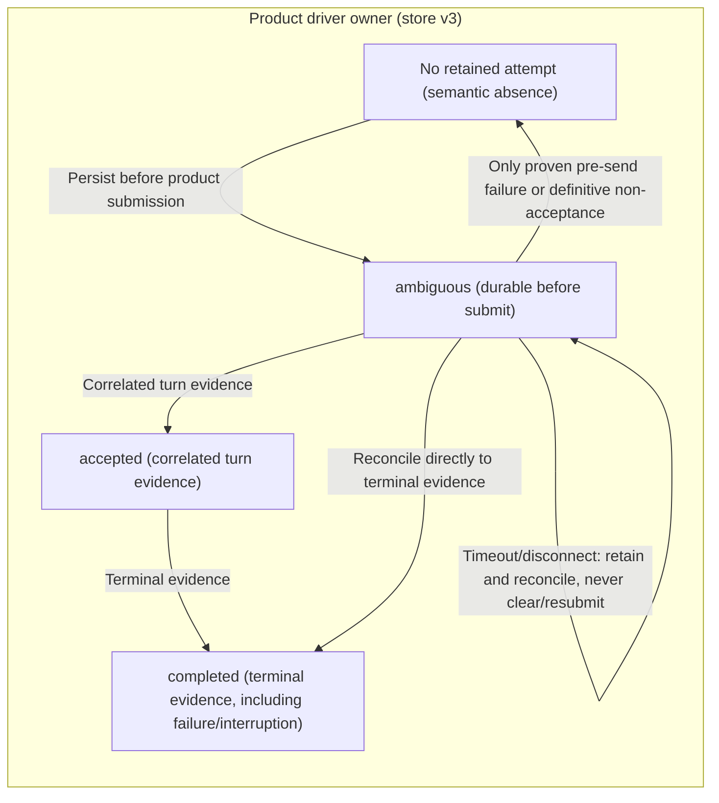

# ADR 0001: Event-driven sidecar with product-specific drivers

- Decision date and evidence cutoff: 2026-09-05.
- Status: architectural direction accepted; first-PR scope defined below; CI and field acceptance tracked separately.
- Design tracking: issue #44.
- Baseline: `main` at `9e36813`; feature branch `codex/connector-contract-foundation`.
- Scope: document the contract before code changes; no deployment authorization.

## Documentation precedes implementation

Architecture and evidence contracts must be recorded before dependent code
changes. Implementation scope, CI results, and field acceptance are separate
records. An ADR does not certify tests or authorize field operations.

## Context

AIChat enables cooperation between independently operated, existing AI workflows
on different hosts. The relay transports explicit project messages; it is not a
model runtime, remote command channel, or source of local execution authority.
Receiving an event, accepting a product turn, persisting a connector checkpoint,
and storing a reply in the relay are different facts.

## Decision

1. Keep a product-neutral sidecar contract for fixed local routing, relay recovery,
   receipt evidence, deduplication, bounded turns, and explicitly authorized egress.
   Product drivers own product-specific submission, reconciliation, and evidence.
   Reuse the existing implementation; do not introduce another delivery engine.
2. Prefer an independent Codex App Server with a dedicated connector-owned task.
   AIChat's stdio integration remains pinned/pre-release. An officially documented
   transport is not a guarantee of production readiness or control over an
   arbitrary active Desktop task across product versions.
3. Keep MCP interactive access as explicit reads and writes in an existing
   workflow, without promising an unsolicited inbound turn from ordinary MCP.
4. Treat Claude native Channels as a candidate requiring its own product
   acceptance; Grok managed-session execution is a separate explicit opt-in.
   Neither implies control of arbitrary consumer web conversations.
5. Keep private Desktop owner IPC non-default, version-coupled, and non-stable.
   The heartbeat bridge remains legacy, not the event-driven architecture.

The official SDK is a **managed-work driver candidate**, not an arbitrary
existing Desktop-task injection interface. Official documentation describes
TypeScript automation/CI with local thread start/continue/resume and a stable
Python SDK controlling a local App Server over JSON-RPC with a pinned runtime.
This can reduce hand-maintained protocol integration. Keep the existing
independent App Server driver in this PR because it already has durable
reconciliation/receipt test coverage, not because it must be the final route.
Before replacing it, validate SDK-visible turn identity, reconciliation,
approval/sandbox policy, event evidence, and durable receipt semantics. Official
SDK maturity does not establish AIChat adapter acceptance.

Official Grok ACP is another **future managed-work driver candidate**. Its
`grok agent` stdio JSON-RPC interface documents `initialize`, `authenticate`,
`session/new`, `session/prompt`, and assistant chunks through `session/update`.
Structured session events may fit the driver evidence contract better than a
single final headless JSON object, but this is an architectural inference, not
an accepted implementation. It does not promise arbitrary existing TUI injection.
AIChat has no implemented or authenticated-tested ACP driver. Example timeouts
and cleanup do not supply durable receipts or ambiguous-submission recovery;
do not copy raw stderr forwarding or `--always-approve` into an adapter.

## State and evidence contract

These are semantic layers, not a new serialized enum or schema migration.

| Owner / layer | States or evidence | Meaning and boundary |
| --- | --- | --- |
| Relay intake | `fetched`, `filtered` | Read or rejected by local gates. Neither is product acceptance, execution, or result delivery. A safely filtered item can be checkpointed without a product receipt. |
| Product driver | logical pre-send / attempting, unknown, accepted, terminal; existing persisted phases `ambiguous`, `accepted`, `completed` | Persist `ambiguous` before submission. A timeout, disconnect, or crash can leave an unknown outcome. Reconcile the same attempt; do not invoke the model again merely because evidence is incomplete. Logical labels do not rename disk phases. Stored phase `completed` includes failed/interrupted outcomes; success requires `completionStatus=completed`. |
| Receipt validation | fresh allowlisted receipt; strict fields; exact delivery / thread / host binding | Validate evidence against the trusted local mapping before delivery checkpoint or driver acknowledgement. Reject missing, mismatched, or malformed evidence. `accepted` alone is not `running`; legacy receipts without `turnId` establish acceptance only. A concrete `turnId` is necessary to associate running evidence with a turn, and an ID alone is not proof of current execution. |
| Connector | durable checkpoint / driver acknowledgement | Persist validated responsibility for a receipt or event before acknowledging the driver. A checkpoint or acknowledgement is bookkeeping, not proof of a completed turn or a relay-stored reply. |
| Egress | `pending`, `relay-stored`, `quarantined`, `resolved` | Persist output and its stable idempotency key before transmission. Relay storage needs a relay receipt or idempotent recovery. Quarantine is not publication; resolution can be a locally authorized retry or drop, not necessarily delivery. |

### Driver-owned attempt state

The diagrams describe different owners, not one linear global state machine.
Only `ambiguous`, `accepted`, and `completed` below are existing driver disk
phases; other nodes are semantic descriptions, not new serialized enums.

Terminal evidence can precede connector checkpoint or driver acknowledgement.
Phase `completed` is not success; local success requires `completionStatus=completed`.

### Connector responsibility and outbox

Early completion remains retained/replayable until the connector atomically
checkpoints responsibility; a lost acknowledgement can cause safe replay, not a
new model submission. Driver acknowledgement and outbox progress are separate.

```mermaid
flowchart LR
    Receipt["Driver owner: delivery receipt"]
    Early["Driver owner: early completion (retain/replay)"]
    subgraph Connector["Connector owner (schema v5)"]
        Validate["Validate receipt/evidence and exact delivery/thread/host"]
        Checkpoint["Atomic cursor + receipt responsibility checkpoint"]
        Ack["Driver acknowledgement (after checkpoint)"]
        Invalid["Invalid evidence: no delivery checkpoint or ack"]
        Validate -->|"Valid evidence; retain early-completion responsibility"| Checkpoint
        Validate -->|"Reject invalid evidence"| Invalid
        Checkpoint --> Ack
    end
    subgraph Outbox["Connector-owned outbox (semantic states)"]
        Pending["pending (persisted payload + fixed idempotency key)"]
        Stored["relay-stored (storage proven, not recipient consumption)"]
        Quarantined["quarantined (not published)"]
        Dropped["resolved (explicit drop, not delivery)"]
        Pending -->|"Timeout/no storage proof: retain same payload/key"| Pending
        Pending -->|"Deterministic policy rejection"| Quarantined
        Quarantined -->|"Explicit operator retry: same payload/key; recheck policy"| Pending
        Quarantined -->|"Explicit operator drop"| Dropped
    end
    Relay["Relay owner: message storage"]
    Receipt -->|"Offer or replay acceptance evidence"| Validate
    Ack -.->|"Checkpoint acknowledged; retain result until egress resolution"| Early
    Early -.->|"Accept result into outbox only with a durable correlating checkpoint"| Pending
    Checkpoint -.->|"Eligible output responsibility; independent of driver ack"| Pending
    Pending -->|"Allowed send/replay: same payload/key"| Relay
    Relay -->|"Ack or same-key recovery proves storage"| Stored
```

Neither diagram promises exactly-once local tool side effects or changes the
existing source, authorization, schema, or store boundaries.

Required invariants:

- Never turn an ambiguous product submission into an automatic second model
  invocation or a fallback submission through another driver. Reconciliation may
  establish the original outcome; missing evidence is not permission to resend.
- Replaying outbound delivery reuses the same persisted payload and idempotency
  key; it never regenerates a model answer. Lost relay acknowledgements remain
  pending until idempotent recovery establishes storage.
- Driver terminal evidence describes the local turn outcome. It is distinct from
  relay storage, remote consumption, and independently verified work results.
  Phase `completed` alone is not successful execution: failed/interrupted turns
  can share that phase. Require `completionStatus=completed` for local success.
- Relay membership, sender allowlists, references, and remote text never grant
  host permissions. Credentials, workspace selection, approval policy, and
  sandbox configuration remain local. Outbound sharing is separately authorized;
  `reply_to` correlates messages but does not restrict the channel audience.
- Fixed diagnostic phase/code values must not include original exception text,
  argument values, tokens, private paths, or message bodies.
- Construct fresh receipts from explicitly allowed fields rather than forwarding
  arbitrary driver objects. Project logger diagnostics onto safe fields and use
  an explicit `safeFailureCode` enum; never accept arbitrary `AICHAT_*` strings
  as safe diagnostic codes.

## Compatibility and frozen field boundary

Retain the existing connector state schema **version 5** and driver store
**version 3**. This work does not migrate, reset, repair, or relocate either store. The
frozen field installation's old **v2** is a deployment namespace, not a claim that
this repository uses state schema version 2. Do not touch that installation,
services, credentials, or state, and do not issue field requests.

## Three-stage delivery gate

1. **ADR and contract:** land this decision before implementation; align the
   architecture, capability matrix, roadmap, and acceptance checklist. Documentation
   does not claim implementation or future tests have passed.
2. **Minimal refactor, conformance, and CI review:** within existing `src`, extract
   product-neutral receipt-evidence validation with fresh allowlisted receipts,
   strict fields, exact delivery/thread/host binding, and rejection before
   checkpoint/ack. Legacy receipts without `turnId` remain accepted-only. Do not
   change disk schema, migrate state, or build another engine. Replace CLI/loader
   raw exceptions, including argument-parsing failures, with fixed phase/code
   diagnostics, logger projection, and an explicit `safeFailureCode` enum, not
   arbitrary `AICHAT_*` passthrough. The test scope includes
   the actual production MCP subprocess against loopback HTTP, with locked
   dependencies on Linux/macOS/Windows and the conformance run under Windows
   PowerShell 5.1. This is isolated conformance, not a field probe. Included in
   this PR; CI results and field acceptance are tracked separately. Scope is not
   a passing result.
3. **Newly authorized single field E2E:** only after stage 2 review and fresh,
   explicit operator authorization, execute one bounded two-host test manifest.
   It must enumerate one Mac request, the exact Windows source envelope, one
   confirmed successful turn, one result with matching `reply_to`, and Mac
   receipt/cursor evidence. It must also enumerate planned connector/driver
   restarts, offline/reconnect, duplicate wakes, cross-store ID reconciliation,
   zero orphan children after drain/exit, and absent canaries in shared output.
   Required drills cannot add a model turn or result. A happy path alone is
   PARTIAL; an unauthorized required subcase is NOT RUN and acceptance remains
   incomplete. No blind retry, state/service migration, or implicit drill
   authorization follows from this decision. Exact subcases/counts are in the
   [acceptance checklist](../validation/connector-two-host-acceptance.md).

## Evidence ledger at the cutoff

- GitHub-verified `main` baseline: `9e36813`; local branch and HEAD agree.
- GitHub-verified PR #42: `f337327`, still Draft with two PowerShell 5.1 failures.
- Read-only check-log verification identifies `identity-success`
  exit mismatches in run `33768346363` / job `100691889709` at log line 1063,
  and run `33768342049` / job `100691846926` at log line 1047. The first mock
  success expected exit 0 but returned nonzero; its actual exit code, JSON, and
  phase were not retained in the logs. The later FastMCP fixture was not reached.
- **Unreproduced static candidate, not a confirmed root cause:** an `if` output
  may unwrap a single-element `content` array into a `PSCustomObject`; accessing
  `.Count` under StrictMode could then produce `internal_error` and exit 2.
  The saved failures do not establish that exception or actual exit code.
  Do not repair or rerun the field probe in this work. Prefer the new hermetic
  production-MCP conformance path; keep #42 Draft until a replacement PR has
  green CI and completed review, after which it may be closed as superseded.
- GitHub-verified PR #38 at commit prefix `aed310910588`: PR checks 28/28 and
  merge checks 14/14 passed (merge CI `33441057665`). PR #39 at commit prefix
  `913483425f70`: PR checks 28/28 and merge checks 21/21, including additional
  checks, passed (main CI `33542773489`). Windows PowerShell 5.1 checks passed
  for both. The differing check totals describe different run scopes.
- Windows field claims remain **last supplied accepted facts, not live
  revalidated**. The evidence chain reaches the saved handoff narrative
  cross-checked against GitHub, not raw field logs or independently rechecked
  receipts. CI pass counts do not upgrade that field-evidence boundary.
- Claude: repository records inbound UI delivery followed by `ECONNREFUSED` on
  the model request; live model-generated reply remains unaccepted.
- Grok: repository records mock-runner coverage, not authenticated real-Grok E2E.
- Receipt validation and production MCP subprocess conformance are included in
  this PR's scope. CI results and two-host E2E are tracked separately; this ledger
  does not pre-certify either.

## Official sources and limits

- [Codex App Server](https://learn.chatgpt.com/docs/app-server#codex-app-server)
  and [Protocol](https://learn.chatgpt.com/docs/app-server#protocol): the official
  page documents default stdio and Unix control-socket transports. Its
  [remote Code Mode host section](https://learn.chatgpt.com/docs/app-server#connect-a-remote-code-mode-host)
  also warns that the app-server command and WebSocket transport are experimental
  and unsupported for production workloads. Preserve both facts. AIChat's
  independent stdio path remains pinned/pre-release, without cross-version
  acceptance of arbitrary existing Desktop tasks or private owner IPC.
- [Official Codex SDK](https://learn.chatgpt.com/docs/codex-sdk): TypeScript
  local-thread automation/CI and the stable Python SDK with a pinned local App
  Server runtime are official alternatives. The App Server introduction
  distinguishes rich custom-client approvals/history/events from SDK-driven
  jobs. Vendor documentation was verified at the evidence cutoff; an AIChat SDK
  replacement driver still requires the contract checks described above.
- [Claude Channels Markdown](https://code.claude.com/docs/en/channels.md), verified
  2026-09-05: research preview; authentication through claude.ai or a Console API
  key, not Bedrock/Google/Microsoft; Team/Enterprise requires organization
  enablement. Events arrive only while the receiving session is open.
- [Channels reference Markdown](https://code.claude.com/docs/en/channels-reference.md),
  verified 2026-09-05: local stdio MCP, `claude/channel` capability,
  `notifications/claude/channel`, and a reply tool. Unapproved custom channels
  require `--dangerously-load-development-channels`. Official permission relay
  exists, but AIChat deliberately does not adopt it; host approval stays local.
- [Grok Build headless scripting Markdown](https://docs.x.ai/build/cli/headless-scripting.md),
  verified 2026-09-05: documents `-p`, `-s`, `-r`, `--output-format`,
  `--no-auto-update`, and the ACP interface described above. These official
  interfaces do not certify the existing bridge or the future ACP driver.
- Additional entry points: [Grok MCP](https://docs.x.ai/build/features/mcp-servers)
  and [xAI API documentation](https://docs.x.ai/). API-managed contexts are not
  evidence of consumer conversation control.

The three Claude/Grok Markdown sources above were verified at the evidence
cutoff. Account eligibility, organization settings, authenticated ACP execution,
and new field acceptance were not verified. Repository implementation
observations and saved acceptance notes remain distinct from official product
guarantees. Consumer UI, managed headless/ACP sessions, and API sessions remain
separate capability categories.

## Consequences and follow-up

The stable target is AIChat's sidecar/driver contract, not an unversioned promise
about vendor internals. Product-specific acceptance remains necessary. This
choice favors explicit capabilities and recoverable evidence over universal
conversation injection. The first PR and each later acceptance must add dated,
redacted evidence without replacing historical failures or frozen field facts.
