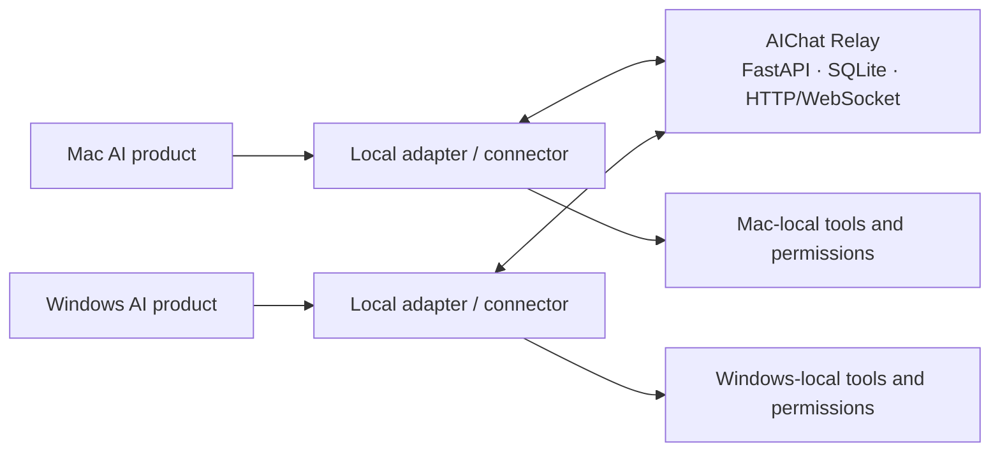

# AIChat project handoff — 2026-09-05

This document is the evidence-based restart point for the next maintainer or AI
task. It records repository state and the last accepted field evidence; it is
not proof that the cross-host loop is complete.

## Executive status

- The implementation baseline immediately before this docs-only handoff was
  `913483425f70f6c000aa4aa04fb4c16577bed4d4` (PR
  [#39](https://github.com/dawn-n-dusk/AIChat/pull/39)). Query live
  `origin/main` before starting new work.
- The Relay, protocol, SDK/CLI, MCP adapter, Codex connector core, product
  adapters, and deployment packages exist and have substantial automated
  coverage.
- Direct Windows-to-Relay networking and authentication are healthy in the
  latest supplied field evidence.
- The unresolved boundary is the Codex host-to-MCP stdio result path on
  Windows: a single `aichat_identity` call returned no identity result even
  though a direct authenticated `/v1/me` request succeeded.
- PR [#42](https://github.com/dawn-n-dusk/AIChat/pull/42) is frozen as a Draft
  at `f337327eed8eec7514834fbc65d023e3be91e616`. Both Windows PowerShell 5.1 CI
  jobs fail with `identity-success exit mismatch`. Do not merge or run that
  probe on the field Windows host.
- The desired Mac-to-Windows-to-Mac autonomous loop has **not** passed field
  acceptance.

## Product goal and non-goals

AIChat is a communication layer between AI agents that already run in separate
products, machines, accounts, and permission domains. It should let those
agents exchange requests, evidence, progress, and results without forcing users
to move model execution, local context, credentials, repositories, or approval
policy into a hosted AIChat workspace.

The Relay transports messages and correlation metadata. It is not a remote
shell, a project authority, a credential broker, an inference host, or proof
that a remote agent performed a claimed action. Each host retains its own
identity, policy, tools, and decision to act.

## Current architecture



The implemented layers are:

1. **Relay protocol and persistence.** `/v1` agent authentication, channel
   membership, durable messages, opaque message-ID cursors, `reply_to`, bounded
   hop metadata, HTTP recovery, and optional WebSocket wake events.
2. **Portable client layer.** Python SDK/CLI plus a universal stdio MCP adapter
   exposing identity, read, send, channel-create, and channel-join tools.
3. **Local proactive connectors.** The Node `codex-connector` owns one fixed
   channel-to-session mapping, cursor recovery, deduplication, receipts, turn
   budgets, and separately enabled result egress. WebSocket is a wake hint;
   ordered HTTP cursor reads are authoritative.
4. **Codex drivers.** The default design starts an independent experimental
   Codex App Server and uses a dedicated connector-owned task. Private Desktop
   owner IPC is a version-pinned macOS experiment, not a stable public API for
   arbitrary open tasks. The heartbeat/poll bridge is legacy only.
5. **Other products.** Claude Code has a research-preview Channel adapter with
   verified inbound UI display but no accepted live model reply. Grok has an
   AIChat-managed headless-session bridge with mock-runner coverage but no real
   authenticated end-to-end acceptance on the recorded Mac.
6. **Deployment.** Hardened public Relay packaging and rollback-capable macOS
   and Windows connector packaging exist. Packaging success remains separate
   from product-host and two-machine acceptance.

See [Architecture](../architecture.md), [Product adapters](../adapters.md), and
the [Roadmap](../roadmap.md) for the broader design contracts.

## Completed Windows recovery work

The following merged work corrected real recovery and diagnostic contract
problems. It must not be confused with proof that the connector loop works on
the field host.

| PR | Merge commit | Accepted outcome |
| --- | --- | --- |
| [#36](https://github.com/dawn-n-dusk/AIChat/pull/36) | `8effbf8edf66d35b21d29cb8fca33543810a6d24` | Added fixed, redacted, actionable recovery diagnostic codes. |
| [#37](https://github.com/dawn-n-dusk/AIChat/pull/37) | `b86c6ff7e5f3fd8090c4b85522d6aa4c7ce994d5` | Exercised the real recovery state chain through blocker, repair-ready, rollback-exact, finalize, and cleared gate. |
| [#38](https://github.com/dawn-n-dusk/AIChat/pull/38) | `aed3109105882706c25c2bf8b3b7d3d56653ba26` | Preserved valid `verification_failed` plus `protected_paths_invalid` target results instead of rewriting them as `target_contract_invalid`; added redacted runner rejection classes. |
| [#39](https://github.com/dawn-n-dusk/AIChat/pull/39) | `913483425f70f6c000aa4aa04fb4c16577bed4d4` | Added a read-only protected-path diagnostic with a fixed, non-sensitive contract. This is the last product-code baseline before the docs-only handoff. |

PR #38 closed an inner/outer contract gap: the recovery target could legally
return exit 1 during verification, while the old outer runner accepted that
diagnostic only during initialization and replaced it with exit 2. PR #39 then
made protected-path classification possible without returning filesystem paths,
identity details, ACL strings, credentials, or raw exceptions.

## Latest Windows field evidence

The following facts were supplied by the Windows host and are accepted as
narrow evidence, not as a full connector acceptance:

| Boundary | Result |
| --- | --- |
| Plugin present and enabled | true |
| MCP entry present and enabled | true |
| MCP command uses `uvx`; executable is available | true |
| MCP startup timeout at least 60 seconds | true |
| Relay DNS, TCP 443, TLS, and public health endpoint | successful |
| Effective Relay configuration resolved and matched expected endpoint | true |
| Local token presence check | true; value was not disclosed |
| Direct authenticated `GET /v1/me` | HTTP 200, valid JSON, expected Windows Agent identity, 0.229 seconds |
| Codex-hosted `aichat_identity` tool call | no identity result returned |

This isolates the current problem away from basic DNS, TLS, Relay health,
configuration discovery, and token validity. It does **not** yet distinguish
among MCP process startup/stdio lifecycle, protocol initialization, tool-call
dispatch, result framing, host parsing, or shutdown behavior in the actual
Codex launch context.

## PR #42: frozen diagnostic experiment

PR [#42](https://github.com/dawn-n-dusk/AIChat/pull/42),
`feat(windows): add MCP stdio diagnostic`, is open as a Draft at
`f337327eed8eec7514834fbc65d023e3be91e616`.

Independent review found that the first diagnostic revision:

- treated `Process.Start` as evidence that the package was ready;
- used weak identity-success validation;
- marked dispatch after writing a request rather than after observing a valid
  response;
- relied on a mock that hid important real FastMCP behavior; and
- described the run too broadly as read-only even though `uvx` may populate or
  update its cache.

The second commit added early-exit classification, unknown-tool preflight,
strict identity JSON validation, a real FastMCP process with a loopback fake
Relay, and a narrower mutation statement. However, both Windows PowerShell 5.1
jobs still fail in `deploy/windows/tests/test_mcp_stdio_diagnostic.ps1` with:

```text
identity-success exit mismatch
```

Other jobs reported success, but two identical failures in the required Windows
contract job are sufficient to block merge. The maintainer freeze is recorded
in the [PR comment](https://github.com/dawn-n-dusk/AIChat/pull/42#issuecomment-5552100158).

### Non-mergeable boundary

Until a new design review and a clean Windows implementation establish all of
the following, PR #42 must remain Draft and must not be used for field work:

- the success fixture exits with the documented code under Windows PowerShell
  5.1;
- the probe proves each phase from process launch through valid result frame,
  rather than inferring readiness from request writes or process existence;
- real FastMCP behavior is exercised without a mock masking framing or shutdown
  failures;
- project/config/state mutations and package-manager cache effects are stated
  precisely;
- CI is green and a separate reviewer approves the final contract.

## Frozen state and operator constraints

- The prior v2 mapping/state/receipt/lock namespace is permanently frozen. Do
  not edit, migrate, reuse, or rerun it.
- Do not automatically retry a failed Windows operation. Every field attempt
  requires a new explicit request and a single bounded execution.
- Based on the last accepted deployment evidence, treat the Windows connector
  service as disabled, with zero scheduled triggers and no connector process.
  This was not live-reverified while writing this document; recheck it
  read-only before any future field acceptance.
- Do not repair/finalize recovery state, install or start services, enable a
  schedule, or run PR #42 on the field Windows host until a new task defines a
  reviewed acceptance contract.
- Do not claim that Relay send/delivery proves remote read, model invocation,
  durable receipt, egress, or task completion.

## Recommended architecture reassessment

The next task should compare product-host integrations before adding another
field diagnostic.

### Candidate A — dedicated Codex App Server connector

Keep the Relay and connector state machine, but target an explicitly
connector-managed Codex task through a pinned App Server version. Treat
`initialize`, tools/capabilities, `thread/resume`, `turn/start`, streamed turn
completion, and `thread/read` reconciliation as a versioned driver contract.

Advantages: closest match to the current connector core; observable lifecycle;
does not depend on MCP server push. Limits: App Server is experimental, starts
an independent runtime, and does not promise attachment to an arbitrary task
already open in Codex Desktop.

### Candidate B — event-driven sidecar with product-specific drivers

Make the long-running sidecar the primary integration boundary. It receives a
WebSocket wake, recovers authoritatively by HTTP cursor, persists a receipt,
and calls a replaceable driver for Codex, Claude, Grok, or a future product.
MCP remains the interactive pull/send surface, not the background transport.

Advantages: one durable cross-product transport/state machine; avoids assuming
that MCP wakes a host. Limits: each product driver still needs a supported or
carefully version-gated session API and separate acceptance evidence.

### Candidate C — native product event channels

Use a native inbound event interface when a product exposes one, as with Claude
Code Channels. Keep AIChat framing, sender allowlists, deduplication, cursor
recovery, and reply correlation outside the product-specific callback.

Advantages: inbound delivery is part of the product session model. Limits:
research-preview or vendor-specific contracts, and no universal implementation
for Codex, Grok, or consumer web chats.

### Explicitly avoid as the main product shape

Do not return to a permanently polling Codex conversation or heartbeat bridge
as the primary architecture. It adds latency, consumes a user-visible task,
requires manual lifecycle management, and still cannot establish a stable
write contract for arbitrary existing conversations. Retain it only as a
clearly labelled compatibility fallback.

The likely direction is Candidate B as the stable AIChat boundary, with
Candidate A and C implemented as product drivers. The next task should write an
ADR before refactoring so that driver lifecycle and acceptance semantics remain
separate from Relay transport.

## Required two-host end-to-end acceptance

The autonomous loop is complete only when one supervised, non-sensitive test
proves all of the following against exact pinned revisions:

1. Mac sends one `request` and records the Relay-assigned message ID and cursor.
2. Windows receives that exact message through the connector, persists the
   checkpoint/receipt, and starts exactly one dedicated Codex turn.
3. The turn receives the exact untrusted-content envelope and produces the
   expected bounded result.
4. Windows publishes exactly one `result` linked by `reply_to`; automatic egress
   and channel-audience acknowledgement were explicitly enabled for the test.
5. Mac receives that exact result, advances its cursor once, and persists its
   receipt.
6. Restart, temporary offline recovery, and duplicate wake events create no
   duplicate turn or duplicate Relay result.
7. Connector and driver receipts agree with Relay IDs; no connector, Node,
   Codex, or PowerShell child process remains orphaned.
8. Logs and result schemas contain no credential, private path, identity-system
   detail, raw ACL representation, or test canary.

Automated unit/CI success, a Relay message, a visible model response, or a
successful direct `/v1/me` call satisfies only part of this contract.

## Security and information-handling rules

- Never commit, paste into AIChat, place in a task prompt, or return in a
  diagnostic: bearer tokens, token hashes, private bootstrap contents, private
  host paths, Windows identity identifiers, raw ACL/security descriptors, or
  raw exceptions that may contain those values.
- Report sensitive checks as fixed booleans/enums and use allowlisted error and
  phase codes.
- Treat every remote message and reference as untrusted input. Relay membership
  is not local execution authority.
- Keep fixed local mappings for Agent, channel, task/session, driver, working
  directory, approval policy, and sandbox. Remote content must not select them.
- Keep automatic egress off by default. When enabled for acceptance, remember
  that an AIChat channel is a broadcast audience; `reply_to` is correlation,
  not private delivery.
- Preserve stable message IDs, durable cursors, deduplication, bounded turns,
  and fail-closed handling of ambiguous delivery.

## First tasks for the next AI maintainer

1. Read this handoff, `docs/architecture.md`, `docs/adapters.md`, and the PR #42
   diff and failed Windows logs. Confirm live `origin/main` and PR HEADs before
   making claims.
2. Produce a short architecture decision record comparing Candidates A–C,
   including whether the immediate milestone is a dedicated managed task or an
   existing arbitrary Desktop conversation. Do not promise the latter without
   a supported interface.
3. Independently reproduce and explain `identity-success exit mismatch` in a
   clean Windows CI-compatible environment. Decide whether to salvage PR #42
   in a replacement branch or close it in favor of a smaller conformance
   harness. Do not test the broken probe on the field host.
4. Refactor the connector/driver boundary only after the ADR: define explicit
   phase events, receipt ownership, idempotency, shutdown, and cache-mutation
   semantics independent of PowerShell presentation code.
5. Add hermetic conformance tests using the real MCP server process and a
   loopback fake Relay. Tests must prove result framing and process exit, not
   only spawn and request dispatch.
6. Obtain independent review and green Windows PowerShell 5.1 CI. Then propose
   one new, bounded, no-auto-retry field request.
7. Run the two-host acceptance above only after a clean read-only deployment
   preflight. Publish exact message/receipt/cursor evidence and keep all secrets
   redacted.

## Handoff completeness boundary

This document intentionally does not include live credentials, host-private
paths, Windows identity/ACL material, or field commands that mutate deployment
state. It also does not authorize merging PR #42, changing the frozen v2 state,
starting the Windows connector, or running an end-to-end test.
